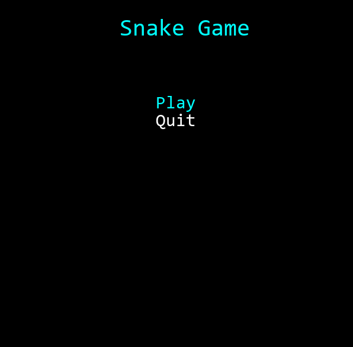
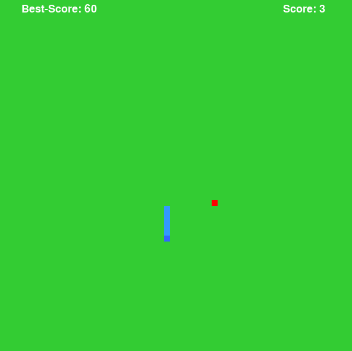

# Python snake game

This game was based on the code created by the user "filhoweuler", it's an adaptation of his code.

## Imports

This game imports the following modules:

* pygame;
* random;
* os.

## Description

Here is the [original code](https://github.com/GabrielEspanholSantos/Pygame-Snake)

The purpose of this project was first to add some missing functions that filhoweuler asked us to make on [his video](https://www.youtube.com/watch?v=H4TXHI9BRCQ). This functions included: the snake's colisions (with the wall and with itself)

I also made some modifications in the game, such as:

* Creation of the snake's speed that increases when the size of the snake is a multiple of eight;
* Correction of some bugs that were occurring originally, like when the UP and RIGHT keys (or something like that) were pressed together, the snake simply was dying;
* Creation of a new interface to the game;
* Creation of the score marking;
* Creation of a score register (using a simple .txt file).

> This is actually not the repository I originally worked in this game, to see the developing process, take a look at my [deprecated repository](https://github.com/GabrielEspanholSantos/hunter-sDungeon)

## How to play 

Use the four standard arrows of your keyboard to move the snake in the desired direction.
