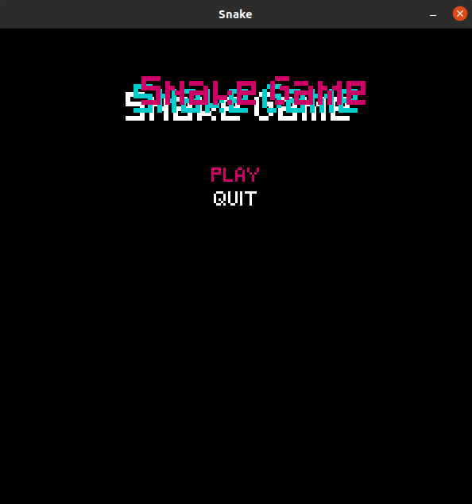
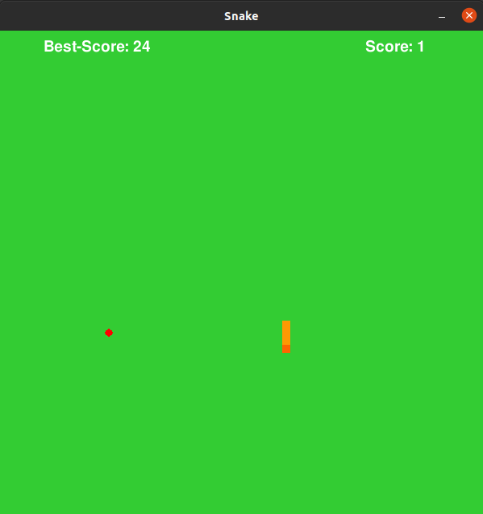

# Python snake game

This game was based on the code created by the user "filhoweuler", it's an adaptation of his code.

## Description

Here is the [original code](https://github.com/GabrielEspanholSantos/Pygame-Snake)

The purpose of this project was first to add some missing functions that _filhoweuler_ asked us to make on [his video](https://www.youtube.com/watch?v=H4TXHI9BRCQ). This functions included: the snake's colisions (with the wall and with itself)

I also made some alterations in the game, such as:

* Creation of the snake's speed, that increases when the size of the snake is a multiple of eight;
* Correction of some bugs that were occurring originally, like when the UP and RIGHT keys (or something like that) were pressed together, the snake just died;
* Creation of a new interface to the game;
* Creation of the score marking;
* Creation of a best score register (using a simple .txt file).

## How to play

Use the four standard arrows (or the keypad arrowed numbers, or the s,e,d,f keys if you are left-handed) of your keyboard to move the snake in the desired direction.
